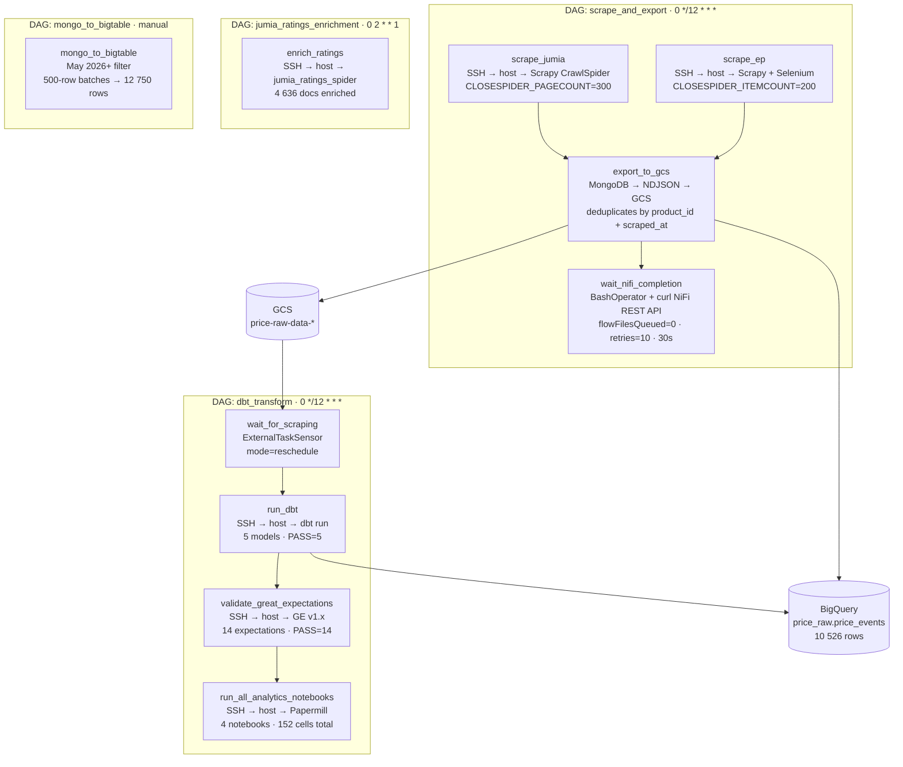
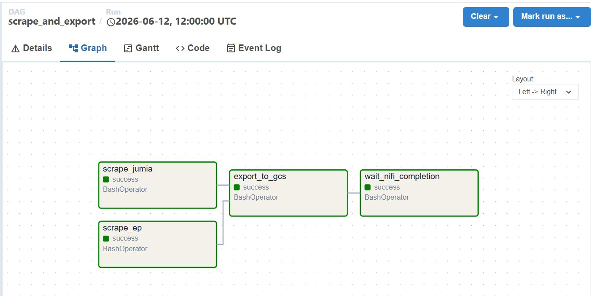
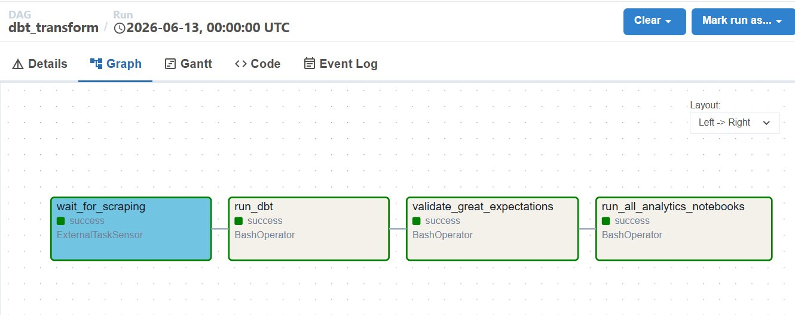
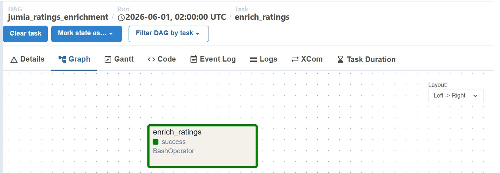
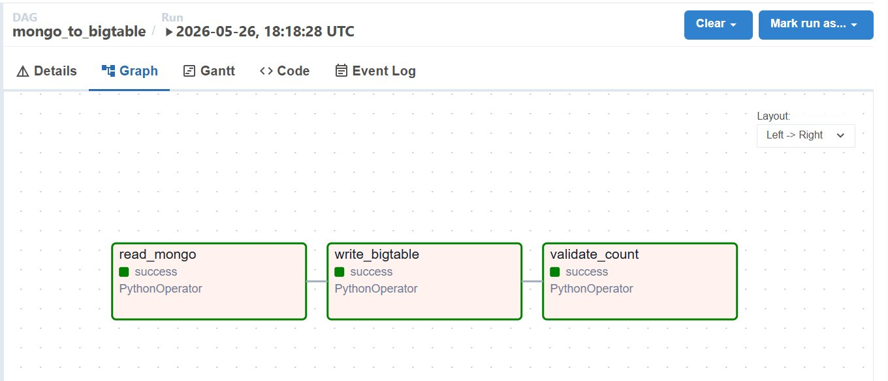

# airflow-dags

> **Price Intelligence Platform** · Batch orchestration layer  
> Apache Airflow 2.11.2 DAGs — scraping, GCS export, dbt transformations, Great Expectations validation, and analytics notebooks.

[](https://airflow.apache.org)
[](https://python.org)
[](https://getdbt.com)
[](https://greatexpectations.io)

---

## Overview

All Airflow DAG definitions for the Price Intelligence Platform batch pipeline. The DAGs orchestrate the complete data flow: scraping → MongoDB → GCS → BigQuery → dbt → Great Expectations validation → analytics notebooks.

**Scope:** Data Engineer owns all DAG code and the custom Docker image.  
**Infrastructure** (Docker Compose, Airflow connections, variables): DataOps responsibility.

---

## Architecture



---

## Repository Structure

```
airflow-dags/
├── dags/
│   ├── scrape_and_export.py          # Main pipeline: scrape + GCS export + NiFi wait
│   ├── dbt_transform.py              # dbt run + GE validation + Papermill notebooks
│   ├── jumia_ratings_enrichment.py   # Weekly: Jumia product page ratings enrichment
│   └── mongo_to_bigtable.py          # One-shot: batch load to Bigtable (500-row batches)
├── great_expectations/
│   └── scripts/
│       └── run_validation.py         # GE v1.x fluent API — 14 expectations on clean_prices
├── config/
│   └── airflow_variables.json        # Import via UI or CLI
├── Dockerfile                        # apache/airflow:2.11.2 + Chrome + ChromeDriver
├── requirements.txt
├── .env.example
├── .dockerignore
├── .gitignore
└── .github/
    └── workflows/
        └── airflow-ci.yml
```

---

## DAGs

### `scrape_and_export` · Every 12 hours

| Task | Type | Notes |
|---|---|---|
| `scrape_jumia` | `BashOperator` | SSH → host → Scrapy `CrawlSpider`, `CLOSESPIDER_PAGECOUNT=300` |
| `scrape_ep` | `BashOperator` | SSH → host → Scrapy + Selenium `--headless=old` (Cloudflare bypass) |
| `export_to_gcs` | `BashOperator` | MongoDB → NDJSON → GCS; deduplicates on `(product_id, scraped_at)` |
| `wait_nifi_completion` | `BashOperator` | `curl` NiFi REST API; checks `flowFilesQueued = 0`; retries=10, retry_delay=30s |

`wait_nifi_completion` uses `BashOperator` with `curl` — not `HttpSensor` — because NiFi requires Bearer token authentication and presents a self-signed TLS certificate. `getent hosts nifi` resolves the container IP dynamically so no hardcoded IP is needed.



### `dbt_transform` · Every 12 hours (after `scrape_and_export`)

| Task | Type | Notes |
|---|---|---|
| `wait_for_scraping` | `ExternalTaskSensor` | `mode='reschedule'` — frees worker slot while waiting |
| `run_dbt` | `BashOperator` | SSH → host → `dbt run --profiles-dir .` — 5 models |
| `validate_great_expectations` | `BashOperator` | SSH → host → GE v1.x script — 14 expectations, exit 1 on failure |
| `run_all_analytics_notebooks` | `BashOperator` | SSH → host → Papermill — 4 notebooks, outputs to `analytics/reports/` |

GE runs as a hard gate: if any expectation fails, the DAG stops before analytics notebooks execute.



### `jumia_ratings_enrichment` · Mondays 02:00

One-shot enrichment spider. Reads Jumia product URLs from MongoDB where `rating` is absent, visits each product page, and updates `rating` + `review_count` via MongoDB `$set`. Last run: 817 URLs, 4,636 documents enriched.



### `mongo_to_bigtable` · Manual

Batch-loads MongoDB documents to Cloud Bigtable. One-shot already executed — kept paused for re-runs.

- Filter: `scraped_at >= '2026-05-01'` (pre-May data excluded — contained pipeline bugs)
- Batch size: 500 rows per `mutate_rows` call
- Result: 12,750 rows in Bigtable



---

## Docker Image

Custom image based on `apache/airflow:2.11.2`.

**Additions over base image:**
- Google Chrome stable (for Selenium-based scraping tasks that run inside the container)
- ChromeDriver managed automatically by Selenium Manager (no manual pinning)
- All Python dependencies from `requirements.txt`

**Key dependencies:**

| Package | Version | Purpose |
|---|---|---|
| `apache-airflow` | 2.11.2 | Orchestration |
| `apache-airflow-providers-google` | 10.12.0 | GCP operators — Bigtable, GCS, BigQuery |
| `apache-airflow-providers-mongo` | 3.3.0 | MongoDB hook |
| `apache-airflow-providers-apache-kafka` | 1.3.1 | Kafka operators |
| `google-cloud-bigtable` | 2.21.0 | Bigtable client |
| `google-cloud-storage` | 2.13.0 | GCS client |

> `dbt` and `great-expectations` are **not** installed in the container — they run on the host machine via SSH. This avoids the container image growing to several GB and keeps the host Python environment authoritative for GCP credentials.

---

## Build & Start

```bash
# From the deployment/ directory
docker compose build airflow-webserver

# First-time initialisation (creates DB, admin user)
docker compose up -d airflow-init
# Wait for exit 0, then:
docker compose up -d airflow-webserver airflow-scheduler

# Import variables
docker exec -it price-airflow-scheduler \
  airflow variables import /opt/airflow/config/airflow_variables.json
```

---

## Required Connections

> **DataOps responsibility** — configure via Airflow UI → Admin → Connections.

| Connection ID | Type | Host | Notes |
|---|---|---|---|
| `mongo_default` | Generic | `<mongodb-service-name>` | Port 27017; schema = database name |
| `google_cloud_default` | Google Cloud | — | Path to service account JSON |
| `nifi_api` | HTTP | `<nifi-service-name>` | Port 8443, schema `https`, `"verify": false` in extras |

> The default Airflow `mongo_default` connection points to host `mongo`. The correct Docker service name for this stack is `price-mongodb`. Always verify after deployment.

---

## Required Variables

```json
{
  "KAFKA_BROKER": "kafka:9092",
  "KAFKA_TOPIC": "price-updates",
  "MONGO_URI": "mongodb://<user>:<password>@<mongodb-service>:27017/<database>",
  "GOOGLE_CLOUD_PROJECT": "price-intel-prod",
  "GCS_BUCKET": "price-raw-data-price-intel-prod"
}
```

---

## Environment Variables (`.env.example`)

```env
# Airflow core
AIRFLOW__CORE__FERNET_KEY=<generate-once-with-cryptography.fernet.Fernet.generate_key>
AIRFLOW__CORE__EXECUTOR=LocalExecutor

# Host machine SSH access (for dbt, GE, Electroplanet, Papermill)
PRICE_INTEL_HOME=<absolute-path-to-project-root>
WSL_USER=<your-username>
WSL_HOST=<auto-updated-by-update_wsl_ip.sh>

# MongoDB (Docker service name inside containers)
MONGO_HOST=<mongodb-service-name>
MONGO_URI=mongodb://<user>:<password>@<mongodb-service>:27017/<database>
MONGO_DATABASE=price_db
MONGO_COLLECTION=price_events

# Kafka (Docker internal listener)
KAFKA_BOOTSTRAP_SERVERS=<kafka-service>:29092
KAFKA_TOPIC=price-updates
KAFKA_DLQ_TOPIC=price-updates-dlq

# GCP
GOOGLE_APPLICATION_CREDENTIALS=<path-to-service-account-json>
GOOGLE_CLOUD_PROJECT=price-intel-prod
GCS_BUCKET=price-raw-data-price-intel-prod

# Scrapy
SCRAPY_FEED_DIR=/opt/airflow/storage
```

---

## SSH Pattern — Why and How

Four tasks run on the host machine rather than inside the container:

| Task | Reason |
|---|---|
| `scrape_ep` | `--headless=old` passes Cloudflare from host; Docker egress is fingerprinted and blocked |
| `run_dbt` | dbt + BigQuery service account lives in the host venv |
| `validate_great_expectations` | GE requires service account JSON; runs after dbt against live BigQuery |
| `run_all_analytics_notebooks` | Papermill + heavy scientific stack (scipy, statsmodels, plotly) not in container |

```
Airflow container
      │
      │  SSH (private key mounted read-only at /home/airflow/.ssh/airflow_rsa)
      ▼
Host machine
  ├── venv/bin/scrapy crawl electroplanet   (--headless=old)
  ├── venv/bin/dbt run                      (BigQuery service account)
  ├── venv/bin/python run_validation.py     (Great Expectations)
  └── venv/bin/python run_notebook.py       (Papermill × 4 notebooks)
```

The SSH key is mounted as a read-only volume (`/home/<user>/.ssh/airflow_rsa:/home/airflow/.ssh/airflow_rsa:ro`). SSH permission: `chmod 644` on the key file. The host machine's SSH server must be running — on Linux/WSL2, configure auto-start via `/etc/wsl.conf [boot] command = service ssh start`.

The host IP changes on every machine restart. `scripts/update_wsl_ip.sh` runs at shell startup (via `.bashrc`) and patches `WSL_HOST` in the DAG file automatically.

---

## Great Expectations

Script: `great_expectations/scripts/run_validation.py`  
Uses GE v1.x fluent API (ephemeral context — no YAML config files, no `great_expectations init`).

**14 expectations on `price_staging.clean_prices`:**

| Category | Expectations |
|---|---|
| Volume | Row count between 5,000 and 500,000 |
| Completeness | `product_id`, `site_name`, `price`, `scraped_at`, `category` not null |
| Domain | `site_name` in `['jumia_ma', 'electroplanet']` |
| Domain | `currency = 'MAD'` |
| Domain | `availability` in `['in_stock', 'out_of_stock', 'unknown']` |
| Price sanity | Price in range [1.0, 200,000] MAD |
| Price sanity | Mean price in range [500, 50,000] MAD |
| Rating | Rating in range [0.0, 5.0] (`mostly=1.0` — nullable column) |
| Grain | `(product_id, scraped_at)` compound unique |

Last result: **14/14 PASS** · June 12, 2026

> GE requires a **service account JSON** (`client_email` + `token_uri`). ADC files produced by `gcloud auth application-default login` are OAuth tokens and will raise `MalformedError` with `sqlalchemy-bigquery`.

---

## Production Notes

**`AIRFLOW__CORE__FERNET_KEY` must be identical** across `airflow-init`, `airflow-webserver`, and `airflow-scheduler`. Generate once with `python3 -c "from cryptography.fernet import Fernet; print(Fernet.generate_key().decode())"` and fix it in `docker-compose.yml`. A different key on each container start makes all stored connection passwords unreadable (`InvalidToken`).

**`env=` in `BashOperator` replaces `os.environ` entirely** — it does not extend it. Always use a `SHARED_ENV` dict that explicitly includes every variable the command needs. Missing one variable silently produces zero scrape output (spider starts, reads config, finds no targets, exits cleanly).

**Docker DNS order matters** — `127.0.0.11` (Docker's internal resolver) must be listed before any public DNS. Placing `8.8.8.8` first breaks container name resolution (`price-mongodb`, `postgres`).

**`ExternalTaskSensor`** — always `mode='reschedule'`. `mode='poke'` holds a worker slot open for the entire wait duration, starving other tasks under `LocalExecutor`.

**`BigtableHook` constructor** — does not accept `project_id`. Pass it to `get_instance(project_id=..., instance_id=...)` instead.

---

## Unpause DAGs

```bash
docker exec -it price-airflow-scheduler airflow dags unpause scrape_and_export
docker exec -it price-airflow-scheduler airflow dags unpause dbt_transform
docker exec -it price-airflow-scheduler airflow dags unpause jumia_ratings_enrichment
```

---

## CI/CD

GitHub Actions — `.github/workflows/airflow-ci.yml`  
Triggers on push to `main`, `develop`, and on pull requests to `main`.

| Job | What it checks |
|---|---|
| `validate-dags` | All DAGs import without errors via `DagBag` |
| `lint-python` | `flake8` on `dags/` and `great_expectations/scripts/` |

---

## Related Repositories

| Repo | Description |
|---|---|
| [`scrapers`](https://github.com/HybridEcomPricePlatform-Org/scrapers) | Scrapy spiders — produces data to MongoDB + Kafka |
| [`nifi-flows`](https://github.com/HybridEcomPricePlatform-Org/nifi-flows) | NiFi streaming — Kafka → GCS |
| [`dbt-transformations`](https://github.com/HybridEcomPricePlatform-Org/dbt-transformations) | dbt models — BigQuery |
| `deployment` | Docker Compose stack — start here |
| `analytics` | Jupyter notebooks — executed via Papermill |

---

*HybridEcomPricePlatform-Org · Data Engineering Portfolio Project · FST Tanger 2025–2026*
